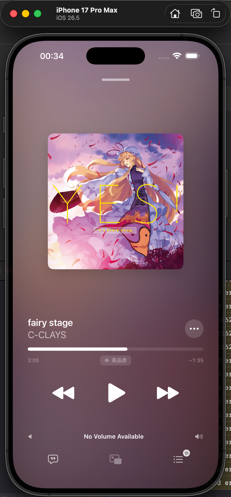
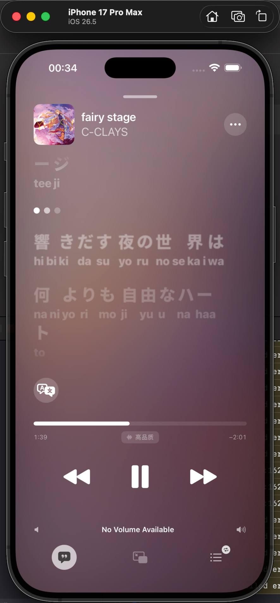
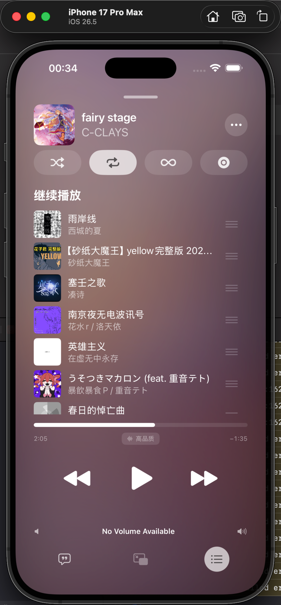
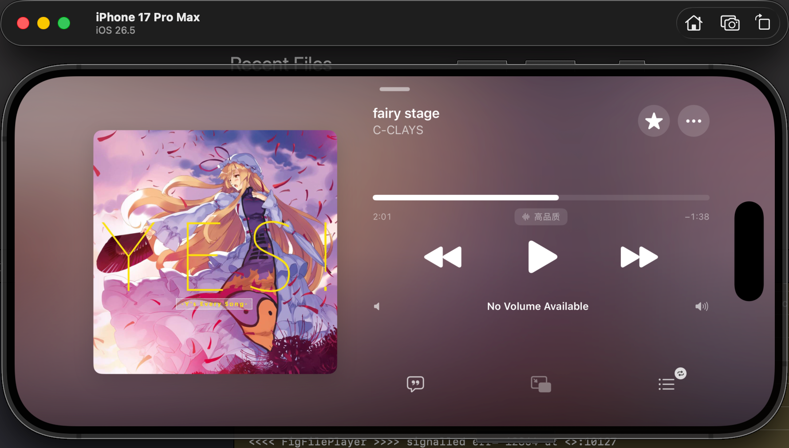
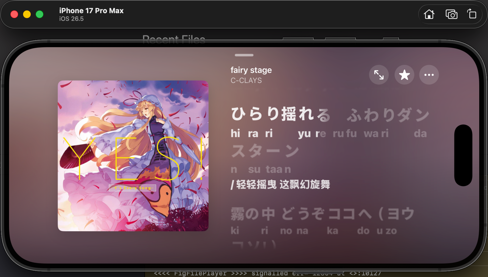
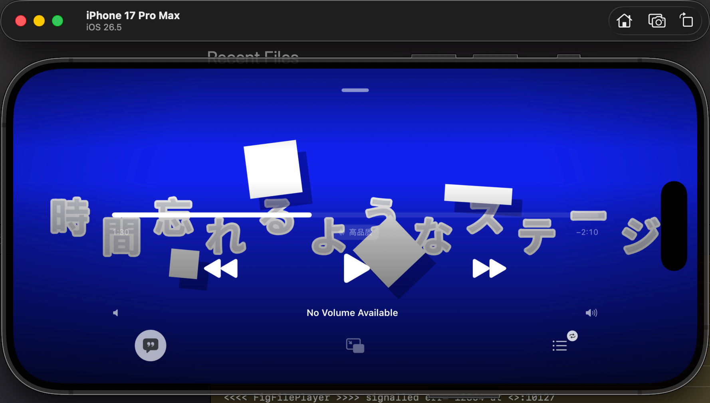

# MeloX

[](https://github.com/youshen2/MeloX/blob/master/LICENSE)
[](https://github.com/youshen2/MeloX/releases)
[](https://github.com/youshen2/MeloX/stargazers)

<p align="center">
  使用原生 SwiftUI 构建的第三方网易云音乐播放器
</p>

[](https://t.me/melox_official)

> MeloX 是非官方开源项目，与网易云音乐及其关联公司不存在隶属、合作或授权关系。项目仍在开发中，接口和功能可能随网易云音乐服务变化而失效。

## 应用截图

### 基础页面

<p align="center">
  
  
  
  <br>
  
  
</p>

### 私信功能

<p align="center">
  
  
</p>

### 播放器

> PS：歌词已实现和Apple Music类似的动效，
> 包括但不限于：
> - 错峰歌词
> - 逐字辉光
> - 可切换的按词/按字抬升
> 等

<p align="center">
  
  
  
</p>

### 横屏播放器

<p align="center">
  
  
</p>

### [特色功能]全屏天际歌词

来自小米yu7天际屏的灵感。

<p align="center">
  
</p>

### [特色功能]文字PV歌词

文字 PV 的模板设计、视觉效果及原始实现来自 DanteAlighieri13210914 开发的
[PV Tool](https://github.com/DanteAlighieri13210914/pv-tool)（Copyright © 2026
DanteAlighieri13210914）。
MeloX 将相关内容移植为原生 SwiftUI，并根据歌词播放进度实时渲染；目前内置 18 种风格，
支持调节动效强度与动画速度，也可在全屏播放器中展示。

> **许可提醒：** 文字 PV 模板、效果实现及相关衍生内容受 PV Tool
> [Non-Commercial License](MeloX/Resources/PVTool-LICENSE.txt) 单独约束，仅可用于非商业用途。
> MeloX 的 GPLv3 许可证不会覆盖或替代该许可。用于商业产品、付费服务或商业化嵌入前，
> 必须另行取得原作者授权；详情请参阅[商业授权说明](MeloX/Resources/PVTool-COMMERCIAL.md)。

<p align="center">
  
</p>

### EVA样式歌词（？）

<p align="center">
  
</p>

## 功能

- 首页内容：编辑推荐、每日推荐、推荐歌单、热门排行、新碟上架和热门歌手。
- 内容浏览：查看歌单、专辑、歌手详情，并按分类发现歌单。
- 聚合搜索：搜索歌曲、专辑、歌手和歌单。
- 网易云账号：通过官方网页完成登录，读取收藏歌曲、收藏歌单和最近播放记录。
- 音乐库操作：收藏或取消收藏歌曲与歌单，将歌曲添加到自己创建的歌单。
- 完整播放器：播放队列、随机播放、列表循环、单曲循环、进度与音量控制。
- 后台播放：支持锁屏播放信息、系统媒体控制、耳机与音频路由变化处理。
- 播放状态恢复：保存当前歌曲、队列、播放位置、循环模式和随机顺序。
- 多档音质：标准、高品质和无损音质；实际可用性取决于账号权限与曲目版权。
- 歌词体验：支持 LRC、YRC 逐字歌词、翻译歌词、伪逐字进度、按词/按字抬升、光效和歌词跳转。
- 文字 PV 歌词：内置 18 种由 PV Tool 移植的动态模板，可调节动效强度和动画速度。
- 横屏天际歌词：提供可调节的当前歌词、后续歌词和环境文字动态效果。
- 自动混音：支持 BeatNet 驱动的智能过渡、速度匹配、固定交叉淡化和可配置的失败回退策略。
- 原生界面：适配 iPhone 与 iPad，并为播放器提供横竖屏布局。

### 智能自动混音

智能自动混音使用 Mojtaba Heydari 开发的 [BeatNet](https://github.com/mjhydri/BeatNet)
通用模型转换而来的 Core ML 模型，用于在设备上分析歌曲的节拍、重拍、速度和开头能量。

MeloX 使用固定 32 秒窗口、FP16 计算精度的 Core ML ML Program；模型输出节拍与重拍激活概率，
特征提取和时序解码由 MeloX 在设备端完成。模型以
[CC BY 4.0](https://creativecommons.org/licenses/by/4.0/) 授权，转换与归属说明见
[BeatNet model notice](MeloX/Resources/Models/BeatNet/BeatNet-NOTICE.md)。

## 运行环境

- Xcode 26.6 或更高版本
- iOS / iPadOS 26.0 或更高版本
- Swift 5
- 用真机运行时，需要可用于代码签名的 Apple Developer 账号

## 本地构建

1. 克隆仓库：

   ```bash
   git clone https://github.com/youshen2/MeloX.git MeloX
   cd MeloX
   ```

2. 使用 Xcode 打开项目：

   ```bash
   open MeloX.xcodeproj
   ```

3. 选择 `MeloX` Target，在 Signing & Capabilities 中设置自己的开发团队；如有需要，同时更换为唯一的 Bundle Identifier。

4. 选择兼容的 iPhone、iPad 或模拟器，然后构建运行。

无需部署额外的后端服务，也无需配置第三方 API 地址。

## 项目结构

```text
MeloX/
├── App/                  # 应用入口、根视图与应用级导航
├── Core/
│   ├── Artwork/          # 封面颜色与视觉数据
│   ├── Cloud/            # 云盘模型与状态
│   ├── Downloads/        # 下载存储与传输
│   ├── Library/          # 账号音乐库状态与收藏操作
│   ├── Lyrics/           # LRC / YRC 模型和解析
│   ├── Models/           # 按账号、音乐、网络和社交分类的业务模型
│   ├── Networking/       # 网易云接口与直接请求客户端
│   ├── Playback/         # AutoMix、播放引擎、均衡器、队列和媒体会话
│   ├── Settings/         # 应用、歌词与播放偏好
│   └── Updates/          # 版本与更新服务
├── Features/
│   ├── Player/           # Now Playing、歌词渲染方案、TextPV 与播放队列
│   ├── Settings/         # 按账号、应用、歌词、播放和系统能力分类的设置页面
│   └── …                 # 首页、发现、搜索、音乐库等独立业务功能
├── Shared/
│   ├── Components/       # 通用状态与辅助视图
│   └── Media/            # 封面、媒体卡片与歌曲行
├── Resources/            # 字体、Core ML 模型与许可证
└── Assets.xcassets/      # 应用图标、强调色与图片资源
```

## 已知限制

- 网易云音乐未公开保证这些接口长期稳定，服务端变更可能导致部分功能不可用。
- 试听、完整播放、音质和地区可用性取决于网易云音乐账号、版权与服务端策略。
- MeloX 不以绕过付费、版权或地区限制为目标。
## 特别鸣谢

- [jayfunc/BetterLyrics](https://github.com/jayfunc/BetterLyrics)：逐字歌词渲染、光效与动效参考。
- [WXRIW/Lyricify-Lyrics-Helper](https://github.com/WXRIW/Lyricify-Lyrics-Helper)：网易云 YRC 逐字歌词解析参考。
- [qier222/YesPlayMusic](https://github.com/qier222/YesPlayMusic)：网易云接口与播放器实现参考。
- [DanteAlighieri13210914/pv-tool](https://github.com/DanteAlighieri13210914/pv-tool)：文字 PV 模板与视觉效果的原始实现。
- [mjhydri/BeatNet](https://github.com/mjhydri/BeatNet)：自动混音使用的节拍、重拍与速度分析模型。

这些项目的代码与资源仍分别受其原始许可证约束。

## 许可证

MeloX 应用主体代码以 [GNU General Public License version 3](LICENSE) 发布。复制、修改或分发本项目时，
请遵守许可证中的源代码提供、版权声明和同许可证分发等要求；具体条款以 `LICENSE` 文件为准。
第三方代码、资源和模型继续适用各自的许可证，其中：

- PV Tool 衍生内容使用 [Non-Commercial License](MeloX/Resources/PVTool-LICENSE.txt)，
  仅限非商业用途，商业使用须另行取得原作者授权。
- BeatNet 通用模型及其 Core ML 转换版本使用
  [Creative Commons Attribution 4.0 International](https://creativecommons.org/licenses/by/4.0/)
  许可证，使用或分发时须保留适当署名、许可证链接及修改说明；详见
  [转换与归属说明](MeloX/Resources/Models/BeatNet/BeatNet-NOTICE.md)。

## 免责声明

本项目出于学习与研究目的开发。MeloX 不对 GPLv3 覆盖的主体代码附加额外限制；
第三方代码、资源和模型仍按上文列出的独立许可证使用。使用者应自行遵守所在地法律法规、
网易云音乐服务条款以及音乐内容的版权要求。项目按许可证所述不提供担保；
因使用本项目产生的风险由使用者自行承担。
